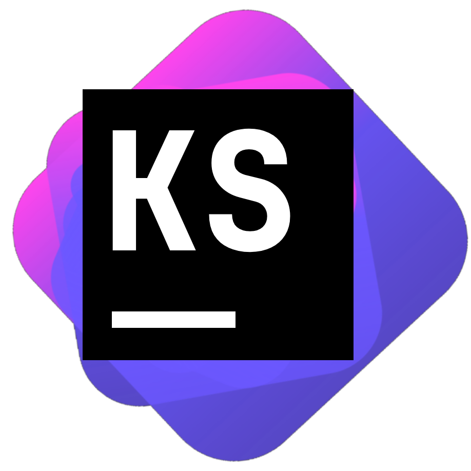

<p align="center">

</p>

<h1 align="center">
KotlinShuttle
</h1>
<p align="center">
A JetBrains-inspired GUI tool for local development of Kotlin.
<p>
<h6 align="center">
<i>This project is an internship submission for the JetBrains internships for 2024. Design and icon are inspired by JetBrains. </i>
</h6>


## Installation

This project is ran on Tauri, which is a Rust framework for building desktop applications using web technologies like SvelteKit which is used in this project. For this Rust, shall be installed on your machine. 

First, clone the project and install the dependencies:

```bash
git clone https://github.com/Zakrok09/KotlinShuttle
cd KotlinShuttle
npm install
```

To run in development mode use:

```bash
npm run tauri dev
```

If you want to build the app use:

```bash
npm run tauri build
```

There are many configurations and options for this command. You can refer to the [Tauri docs](https://tauri.app/v1/guides/building/) for more information.

## Usage

The app is pretty simple to use. You have a left pane for editing your code and a right pane for viewing the output. You can save the code from the left pane and run it using the run button. The output will be displayed on the right pane.

**NOTE: ** Make sure to save the code before executing it.

## Binary

You can also download the binary for your platform from the releases.
